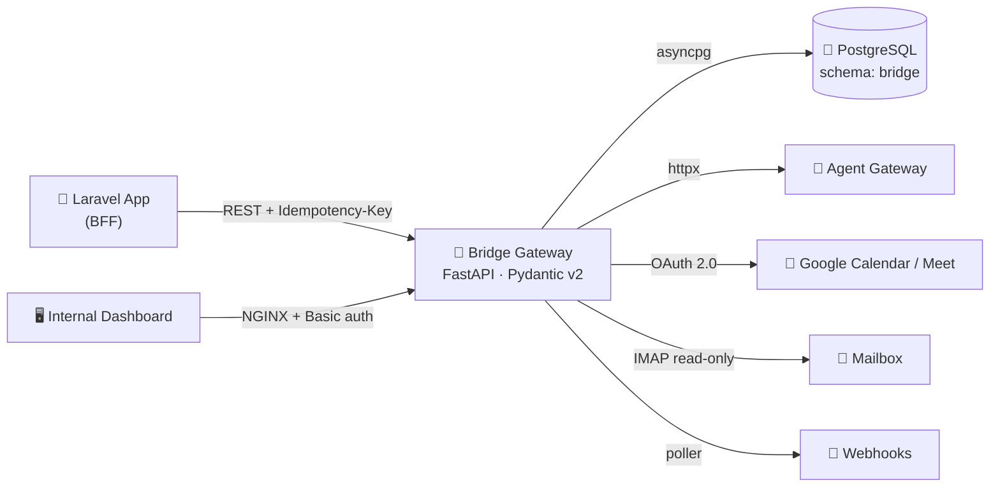

<div align="center">

<a href="https://github.com/RadhitaRayy">
  
</a>

<p>
  
  
  
</p>

<p>
  <a href="https://linkedin.com/in/radhitarayhan"></a>
  <a href="mailto:radhitarayhan@gmail.com"></a>
  
</p>


</div>

## 👨‍💻 About Me

```python
class RadhitaRayhan:
    role      = "Back-End Developer / Full-Stack Developer"
    focus     = ["API gateways", "service integration", "async Python"]
    daily     = ["FastAPI", "PostgreSQL", "Docker", "Laravel"]
    learning  = ["microservices", "Kubernetes", "observability"]
    debugger  = "console.log()  # and I'm not ashamed 😄"
```

Saya membangun **service back-end** yang menjadi jembatan antar-sistem — REST API,
integrasi OAuth pihak ketiga, background job terjadwal, dan deployment berbasis
container. Fokus saya sekarang: **FastAPI + PostgreSQL async** untuk trafik
request/response yang harus rapi, idempoten, dan mudah di-trace.

<br />

## 🧰 Tech Stack

<div align="center">

**Core — yang saya pakai sehari-hari**


**Also comfortable with**


**Exploring**


<br />


</div>

<br />

## 🌉 Featured Work — Bridge Gateway

> Middleware **FastAPI** yang menjembatani platform aplikasi dengan gateway agen AI.
> Satu pintu REST untuk aktivasi, onboarding, chat, kalender, connector, dan billing.



<table>
  <tr><td><b>Runtime</b></td><td>Python 3 · FastAPI · Uvicorn · Pydantic v2</td></tr>
  <tr><td><b>Data</b></td><td>PostgreSQL pada schema terpisah, akses async via <code>asyncpg</code></td></tr>
  <tr><td><b>Integrasi</b></td><td><code>httpx</code> client · OAuth 2.0 (Google Calendar/Meet/Gmail) · IMAP read-only · webhook poller</td></tr>
  <tr><td><b>Deploy</b></td><td>Docker Compose · NGINX reverse-proxy + Basic auth · log harian persisten</td></tr>
  <tr><td><b>Ekstra</b></td><td>Dashboard internal (vanilla JS) · koleksi Postman · dokumentasi antar-tim</td></tr>
</table>

<details>
<summary><b>🔍 Apa yang saya kerjakan di sini</b></summary>

<br />

- **Desain kontrak API** — 20+ router modular (aktivasi, onboarding, chat, kalender, connector, usage, VM, persona)
- **Relasi 1:N** antar entitas instance ⇄ agent, beserta migrasi datanya
- **Idempotensi** request lewat header `Idempotency-Key`, aman terhadap retry klien
- **Roll-up usage/billing** — agregasi event token per agen dan per instance
- **Background job** — poller webhook dan sweeper terjadwal tanpa flap saat restart
- **Observability** — log terstruktur harian, health probe, dashboard status internal

</details>

<br />

## 📊 GitHub Analytics

<div align="center">


</div>

<br />

## 🎯 Currently

| | |
|---|---|
| 🔭 | Membangun **API gateway & service integration** untuk platform agen AI |
| 🌱 | Mendalami **microservices, Docker orchestration, observability** |
| 👯 | Terbuka untuk kolaborasi **open source** dan proyek web yang menantang |
| 💬 | Tanya saya soal **Python/FastAPI, REST API design, PHP/Laravel, PostgreSQL** |
| 📫 | Kontak: **radhitaray123@gmail.com** |

<br />

<div align="center">


**Thanks for visiting! 👋**  
<sub>⭐ Star repo yang menurutmu menarik — itu bikin saya senang.</sub>

</div>
